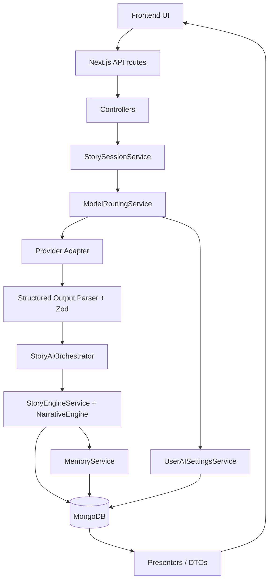
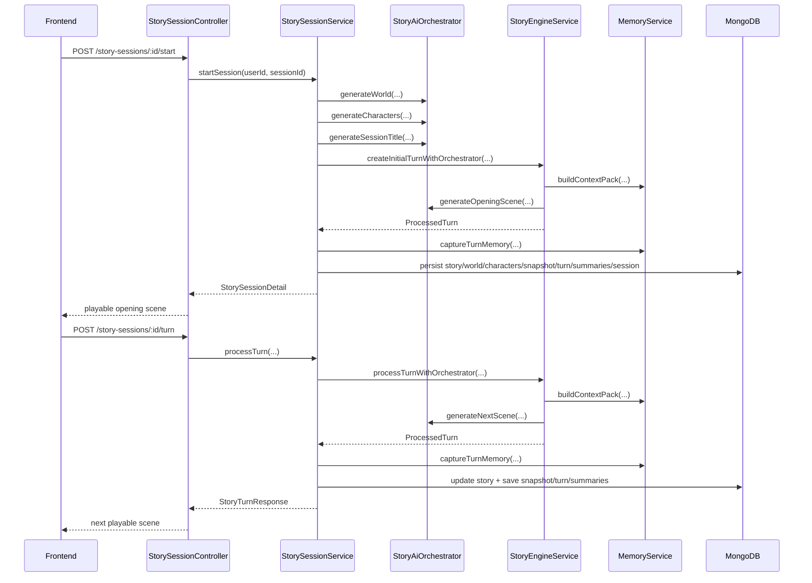

# AI System Overview

This document summarizes the AI system as implemented in the current codebase.

Scope:

- Primary gameplay path: `story-sessions`
- Supporting AI features: AI settings, model routing, recap, summaries, story idea rewrite
- Source of truth: current code under `src/server`, `src/app/api`, `src/features`, and `src/lib`

This overview is intentionally explicit about what is active today versus what is only scaffolded for future use.

## Current Status At A Glance

Active in the live `story-sessions` flow:

- `world_generation`
- `character_generation`
- `opening_scene`
- `next_scene`
- `choice_generation` (fallback path when a non-terminal scene returns too few choices)
- `custom_action_interpretation` (best-effort AI normalization for custom actions, with deterministic fallback)
- `summarization` (rolling summaries only, on interval)
- `consistency_check` (active when enabled by env)
- `session_title`
- `recap`

Configured in env/context, but not fully implemented as a runtime loop:

- provider/model pricing is only used for `estimatedCostUsd` when explicit pricing data exists in the catalog

Important implementation note:

- The runtime now respects `storyOutputLanguage` through the story-session loop, scene prompts, fallback scene text, deterministic fallback choices, and custom opening bootstrap text.

## 1. High-Level AI Architecture

### What the AI system does

The app uses AI to generate story setup and scene content, then runs deterministic backend logic to decide what becomes canonical game state.

At a high level:

1. The backend creates or loads a story session.
2. The routing layer chooses a provider/model for each AI task.
3. Prompt templates render structured requests.
4. A provider adapter invokes the chosen model.
5. The response is parsed and validated against Zod schemas.
6. The narrative engine merges AI suggestions with server-owned rules, rolls, and state updates.
7. Memory and persistence layers store the resulting turn, summaries, and snapshots.
8. Presenters return a playable scene DTO to the frontend.

### What parts are handled by AI

AI is responsible for:

- world setup
- cast generation
- session title generation
- opening scene prose
- next scene prose
- suggested state deltas
- suggested relationship deltas
- suggested inventory/ability/flag/world-memory changes
- suggested choices inside scene payloads
- recap generation
- rolling turn summarization
- optional story idea rewrite on the create-session page

### What parts are controlled by backend logic

Backend logic is responsible for:

- auth, session ownership, and rate limiting
- request validation and moderation
- provider/model routing
- retries, timeouts, and provider error normalization
- deterministic action validation
- deterministic risk / roll / outcome resolution
- canonical state storage
- clamping and sanitizing AI-proposed deltas
- contradiction prevention
- memory assembly
- persistence of sessions, world, characters, snapshots, turn logs, and summaries
- DTO shaping for the frontend

### Why the backend narrative engine remains the source of truth

The backend does not blindly trust AI output.

- `NarrativeEngine` and `StoryEngineService` own action validation, roll resolution, baseline effects, and state application.
- AI returns suggestions in a structured contract, but the server sanitizes keys, clamps values, merges only allowed deltas, and can replace invalid choices with deterministic fallbacks.
- Canonical state lives in persisted `StoryState` and snapshots, not in prose.
- Canon facts reject conflicting summary updates instead of rewriting canon automatically.

### Architecture Diagram

## 2. Main AI Flow

### Important clarification

The user-visible "create and start a story" flow is split across two backend calls:

1. `POST /api/story-sessions`
   This creates a paused session record only. No AI generation happens here.
2. `POST /api/story-sessions/:id/start`
   This performs the AI bootstrap and returns the first playable scene.

### Flow: create session, then start session

#### A. Create story session

Route path:

- `src/app/api/story-sessions/route.ts`

Main code:

- `StorySessionController.create`
- `StorySessionService.createSession`

Steps:

1. Validate input with `createStorySessionSchema`.
2. Load user preferences and read `storyOutputLanguage`.
3. Create a paused `StorySession` record with metadata, premise, genre, tone, preset, seed, and language.
4. Return the session list item DTO.

No AI calls happen yet.

#### B. Start session

Route path:

- `src/app/api/story-sessions/[id]/start/route.ts`

Main code:

- `StorySessionController.start`
- `StorySessionService.startSession`

Steps:

1. Authenticate user and acquire a generation permit with `withGenerationPermit`.
2. Load the owned session.
3. If a `storyDocumentId` already exists, skip generation and return the existing session.
4. Build a `StoryAiOrchestrator` with `userId` so routing can use per-user AI settings.
5. Resolve the story output language from session metadata / preferences.
6. Run `generateWorld`.
7. In parallel, run:
   - `generateCharacters`
   - `generateSessionTitle`
8. Call `TurnProcessingService.createInitialTurnWithOrchestrator(...)`.
9. Inside the turn processor:
   - create initial deterministic `StoryState`
   - build a context pack
   - run `generateOpeningScene`
   - finalize the turn through `StoryEngineService`
10. Capture memory with `MemoryService.captureTurnMemory(...)`.
11. Seed relationship state from generated characters into canonical runtime state.
12. Persist:
   - `Story` document
   - `StoryWorld`
   - `CharacterState[]`
   - `SessionStateSnapshot`
   - `TurnLog`
   - `StorySummary[]`
   - updated `StorySession`
13. Return `StorySessionDetailDto` with:
   - world
   - current scene
   - choices
   - core state
   - dynamic stats
   - relationships
   - memory/canon fields

#### Note on "generate choices"

The primary scene tasks still return choices inline, but the runtime can now call `generateChoices` as a fallback path when a non-terminal scene returns too few usable choices.

### Flow: choose an option or submit a custom action

Route paths:

- `POST /api/story-sessions/:id/turn`
- `POST /api/story-sessions/:id/custom-action`

Main code:

- `StorySessionController.turn`
- `StorySessionController.customAction`
- `StorySessionService.processTurn`

Steps:

1. Authenticate user and rate-limit generation.
2. Validate request body:
   - choice turn: `storySessionActionSchema`
   - custom action: `storySessionCustomActionSchema`
3. For custom input, run `moderateCustomInput(...)`.
4. Load the owned session and canonical `Story` document.
5. Create a user-aware `StoryAiOrchestrator`.
6. Normalize the runtime story state and set `storyOutputLanguage`.
7. Call `TurnProcessingService.processTurnWithOrchestrator(...)`.
8. Inside the turn processor:
   - `NarrativeEngine.validateAction(...)`
   - `NarrativeEngine.normalizeAction(...)`
   - server computes risk, roll, outcome, and baseline effects
   - `MemoryService.buildContextPack(...)`
   - call `generateNextScene`
   - finalize the turn through `StoryEngineService`
9. Capture memory:
   - always update short / medium / canon summaries
   - run AI rolling summarization only when `turnNumber % MEMORY_SUMMARY_INTERVAL === 0`
10. Persist:
   - updated `Story`
   - `SessionStateSnapshot`
   - `TurnLog`
   - `StorySummary[]`
   - synced `CharacterState[]`
   - updated `StorySession`
11. Return `StoryTurnResponseDto` with:
   - updated session detail
   - newly generated scene
   - summary bundle

#### Note on custom action interpretation

Custom actions now use a hybrid path:

- first try `custom_action_interpretation`
- if that AI step fails, fall back to deterministic `NarrativeEngine.normalizeAction(...)`

The backend still remains authoritative because only intent normalization is AI-assisted; canonical state resolution stays server-owned.

#### Note on "generate next choices"

`generateNextScene` still returns prose plus choices in the main path.

If a non-terminal scene returns too few choices:

1. the runtime tries `choice_generation`
2. if that still does not produce enough usable choices, deterministic fallback choices are used

### Start/Turn Sequence Diagram

## 3. AI Tasks

The task names below are the canonical routeable task IDs used by the AI system.

| Task | Purpose | Main input context | Output format | Typical model profile | When it runs | Runtime status | Related files |
| --- | --- | --- | --- | --- | --- | --- | --- |
| `world_generation` | Build the session's setting, rules, player role, conflict, and starting location. | genre, tone, premise, preset, language | strict JSON object | strong storytelling / reasoning model | session start | Active | `src/server/ai/prompts/world-generator.ts`, `src/server/ai/contracts/contracts.ts`, `src/server/services/story-session-service.ts` |
| `character_generation` | Generate a compact cast with roles, traits, initial relationship score, flags, and secrets. | premise + world output + language | strict JSON object | strong character/dialogue model | session start | Active | `src/server/ai/prompts/character-generator.ts`, `src/server/services/story-session-service.ts` |
| `opening_scene` | Write the first long-form scene and suggest deltas/choices. | full `NarrativeContextPack` | strict JSON scene-turn payload | best storytelling model | session start | Active | `src/server/ai/prompts/opening-scene-generator.ts`, `src/server/narrative/story-engine-service.ts` |
| `next_scene` | Write the next long-form scene after the server resolves roll/risk/outcome. | `NarrativeContextPack` + optional latest scene | strict JSON scene-turn payload | best storytelling model | every turn | Active | `src/server/ai/prompts/next-scene-generator.ts`, `src/server/narrative/story-engine-service.ts` |
| `choice_generation` | Generate a compact list of next actions. | context pack + scene summary | strict JSON choice list | fast structured-output model | fallback when a non-terminal scene returns too few choices | Active as fallback | `src/server/ai/prompts/choice-generator.ts`, `src/server/ai/ai-orchestrator.ts`, `src/server/narrative/story-engine-service.ts` |
| `custom_action_interpretation` | Interpret free-text player intent without narrating outcomes. | context pack + raw action | strict JSON classifier output | fast reasoning model | custom action turns before scene generation | Active with deterministic fallback | `src/server/ai/prompts/custom-action-interpreter.ts`, `src/server/ai/ai-orchestrator.ts`, `src/server/narrative/story-engine-service.ts` |
| `summarization` | Compress recent turns into rolling memory and canon updates. | context pack + recent turns | strict JSON summary bundle | fast low-cost model | every `MEMORY_SUMMARY_INTERVAL` turns | Active, interval-based | `src/server/ai/prompts/turn-summarizer.ts`, `src/server/memory/memory-service.ts` |
| `consistency_check` | Detect continuity drift in a candidate scene. | context pack + candidate scene | strict JSON validity report | reasoning-heavy model | opening / next scene generation when enabled | Active when enabled | `src/server/ai/prompts/consistency-checker.ts`, `src/server/ai/ai-orchestrator.ts`, `src/server/narrative/story-engine-service.ts` |
| `session_title` | Generate a concise, tone-matching title and rationale. | genre, tone, premise, preset, language | strict JSON title object | cheap helper model | session start | Active | `src/server/ai/prompts/session-title-generator.ts`, `src/server/services/story-session-service.ts` |
| `recap` | Produce a player-facing recap with highlights and open threads. | context pack + recent turns | strict JSON recap bundle | balanced summarization model | on recap request | Active | `src/server/ai/prompts/recap-generator.ts`, `src/server/services/story-session-service.ts` |

### Additional AI feature outside the core task list

The create-session page also has an AI rewrite helper:

- route: `POST /api/story/rewrite`
- service: `src/server/services/story-idea-rewrite-service.ts`

This feature:

- is not part of the playable turn loop
- reuses the `generateWorld` route selection to pick a model
- sends its own ad hoc structured request directly to a provider adapter

## 4. Provider System

### Supported providers

User-configurable providers:

- OpenAI
- Anthropic
- Google Gemini
- xAI / Grok

Internal fallback provider:

- `bootstrap`

`bootstrap` is a local/offline fallback that skips real network calls and returns prompt-level fallback objects.

### How provider abstraction works

Core abstraction:

- `AiProvider` interface in `src/server/ai/types.ts`

Main implementations:

- `BaseAiProvider`
- `OpenAiProvider`
- `AnthropicProvider`
- `GoogleGeminiProvider`
- `XaiProvider`
- `BootstrapProvider`

`StoryAiOrchestrator` does not know provider-specific API details. It:

1. resolves an `AiRoute`
2. creates the matching provider adapter
3. sends an `AiStructuredRequest`
4. receives an `AiInvocationResult`

Task execution is now shaped by task runtime profiles that provide:

- reasoning-effort defaults and caps
- per-task timeout budgets
- per-task retry counts
- per-task output-token budgets
- per-task context trimming limits

### Provider adapter structure

Shared behavior lives in `BaseAiProvider`:

- request ID creation
- retry loop
- timeout wrapping
- structured output parsing
- Zod validation
- retryability rules
- normalized error mapping
- structured repair logging

Provider-specific behavior lives in each adapter:

- client construction
- auth credentials
- provider-specific request payload
- usage extraction
- model resolution
- timeout overrides

### Structured JSON handling by provider

OpenAI:

- Uses `openai.responses.create(...)`
- Sends `text.format = { type: "json_schema", strict: true, schema: ... }`
- Supports `reasoning.effort` when enabled
- Supports custom base URLs for OpenAI-compatible providers

xAI:

- Uses the OpenAI-compatible `responses.create(...)` interface
- Also sends strict `json_schema`

Google Gemini:

- Uses direct REST `fetch(...)`
- Requests `responseMimeType: "application/json"`
- Still relies on local parsing and Zod validation after the response

Anthropic:

- Uses `messages.create(...)`
- Does not send a provider-native JSON schema in the current implementation
- Relies on prompt instructions plus local parse/repair/validation

Bootstrap:

- Does not call an external model
- Returns `request.fallback()`

OpenAI-compatible custom providers:

- The OpenAI adapter now supports per-user `baseUrl` overrides such as `https://api.krouter.net/v1`
- These routes are marked as OpenAI-compatible with `wireApi: "responses"`
- For non-official OpenAI base URLs, the adapter relaxes provider-native strict JSON assumptions and relies on local parsing/Zod validation more heavily

### How provider errors are normalized

Base normalization happens in `BaseAiProvider.normalizeProviderError(...)`.

Examples:

- timeout-like text -> `AI_PROVIDER_TIMEOUT`
- invalid / unsupported model text -> `AI_MODEL_NOT_SUPPORTED`
- JSON / parse text -> `AI_MALFORMED_RESPONSE`
- schema / zod / validation text -> `AI_STRUCTURED_OUTPUT_INVALID`
- anything else -> `AI_PROVIDER_UNAVAILABLE`

### Retries and timeouts

Global defaults:

- retries: `AI_MAX_RETRIES`
- timeout: `AI_REQUEST_TIMEOUT_MS`
- backoff: `AI_RETRY_BASE_DELAY_MS` to `AI_RETRY_MAX_DELAY_MS`

Retryable categories:

- malformed JSON
- Zod validation failures
- timeouts
- rate limits
- common network / 5xx style failures

xAI special-case:

- reasoning models get at least 90s
- non-reasoning xAI calls get at least 45s

## 5. Per-User AI Settings

Main files:

- `src/server/services/user-ai-settings-service.ts`
- `src/server/security/secret-encryption.ts`
- `src/server/persistence/models/user-ai-settings-model.ts`
- `src/features/profile/ai-settings-form.tsx`

### How users save API keys

Flow:

1. Frontend sends `PATCH /api/me/ai-settings`
2. `UserAISettingsController.update` validates payload
3. `UserAISettingsService.updateUserAISettings(...)` merges the new settings
4. New keys are encrypted before persistence
5. Only masked metadata is returned to the client

### How keys are encrypted

Implementation:

- AES-256-GCM
- versioned payload format: `v1:iv:tag:ciphertext`
- encryption key derived from `AI_SETTINGS_ENCRYPTION_KEY` via SHA-256

### How masked keys are returned

`maskSecret(...)` returns:

- `****` for very short keys
- otherwise prefix + `****` + last 4 chars

Examples:

- `sk-openai-test-1234` -> `sk-****1234`
- `xai-secret-9876` -> `xai-****9876`

### How provider enable/disable works

Each provider has:

- `isEnabled`
- `hasApiKey`
- `encryptedApiKey`
- `apiKeyMasked`
- `baseUrl`
- `defaultModel`
- `reasoningEffort`
- `taskModels`
- `headers`

A provider is usable only when:

- `isEnabled === true`
- a saved encrypted key exists

### How default provider/model is selected

At the user-settings layer:

1. explicit task override provider
2. user default provider
3. first enabled provider with a valid key

Once the provider is chosen, model resolution is:

1. override model for that task, if present
2. provider-level `taskModels[task]`, if present
3. task-aware recommended model
4. provider default model saved in user settings
5. provider catalog default model

### How task-specific provider/model overrides work

Task overrides live in:

- `taskOverrides: Partial<Record<UserAITask, { provider, model?, reasoningEffort? }>>`

These are validated against:

- provider existence
- provider enabled state
- presence of a saved key
- provider model catalog support

### How app-level fallback API keys work

If no user route is available and app fallback is allowed:

- `ModelRoutingService` uses env-based provider selection
- credentials come from `OPENAI_API_KEY`, `ANTHROPIC_API_KEY`, `GOOGLE_GEMINI_API_KEY`, or `XAI_API_KEY`

This is controlled by:

- `AI_PROVIDER`
- `AI_ALLOW_APP_PROVIDER_FALLBACK`

### How missing keys are handled

Two common cases:

1. No usable user route and no usable app fallback
   - `AI_ROUTE_NOT_CONFIGURED`
2. Provider adapter instantiated without credentials
   - `AI_PROVIDER_NOT_CONFIGURED`

If a stored user key cannot be decrypted:

- `AI_CREDENTIAL_DECRYPT_FAILED`

### Important implementation gap

The backend supports provider-level `taskModels` and OpenAI header fields (`organizationId`, `projectId`). The current settings UI now exposes:

- provider enable/disable
- API key save/replace/clear
- base URL
- provider default model
- provider default reasoning effort
- task override provider/model

## 6. Model Routing

Main files:

- `src/server/ai/routing/model-routing-service.ts`
- `src/server/ai/routing/tasks.ts`
- `src/lib/ai/provider-catalog.ts`

### How the app chooses a provider/model for each task

Logical priority:

1. user task override
2. user default provider
3. first enabled configured user provider
4. app-level fallback provider from env
5. error if nothing is configured

Task-aware routing now prefers lighter recommended models for setup/support tasks and stronger models only for the most important storytelling tasks.

### Task override priority

Task name mapping is defined in `AI_TASK_ROUTE_MAP`, for example:

- `generateWorld` -> `world_generation`
- `generateNextScene` -> `next_scene`
- `summarizeTurns` -> `summarization`

Each AI task first resolves its user-facing route task ID, then asks `UserAISettingsService.resolveTaskAssignment(...)` for the best user route.

### Default model fallback

There are two different default-model sources:

- user route -> provider catalog default if the user did not save one
- app fallback -> provider env default (`OPENAI_MODEL`, `ANTHROPIC_MODEL`, etc.)

Effective model selection is now task-aware by default. Examples:

- `world_generation` -> medium reasoning
- `character_generation` -> medium
- `opening_scene` -> high quality
- `next_scene` -> balanced by default, optionally higher reasoning on later/repair turns
- `summarization` -> cheap/fast
- `session_title` -> cheap/fast

### App fallback behavior

If `AI_ALLOW_APP_PROVIDER_FALLBACK` is true and no user route is usable:

- the router falls back to the env-selected provider
- the route source becomes `app_fallback`

If false:

- the request fails with `AI_ROUTE_NOT_CONFIGURED`

### Credential source priority

Actual credential source order:

1. user settings decrypted secret
2. app fallback env key
3. direct provider constructor credentials, if the orchestrator was created with a provider instance manually
4. bootstrap fallback

In current app runtime, the normal gameplay path is:

- per-user settings first
- then app fallback env

### Logging fields

Important route / invocation fields include:

- `provider`
- `model`
- `task`
- `routeSource`
- `credentialSource`
- `userId`
- `attempt`
- `requestId`

Where they appear:

- `ai.route_selected`
- `ai.invoke_attempt`
- `ai.invoke_failed`
- `ai.info`
- `ai.warn`

Current `credentialSource` values:

- `user_settings`
- `app_fallback_env`
- `bootstrap`
- `direct_provider`

Important nuance:

- console logs include route/credential details
- analytics persistence currently stores provider/model/task/latency/attempts, but does not persist `routeSource` or `credentialSource`

## 7. Prompt System

Main files:

- `src/server/ai/prompts/*.ts`
- `src/server/ai/prompts/shared.ts`
- `src/server/ai/contracts/contracts.ts`

### Where prompt templates live

One file per AI task:

- `world-generator.ts`
- `character-generator.ts`
- `opening-scene-generator.ts`
- `next-scene-generator.ts`
- `choice-generator.ts`
- `custom-action-interpreter.ts`
- `turn-summarizer.ts`
- `consistency-checker.ts`
- `session-title-generator.ts`
- `recap-generator.ts`

### How prompts are rendered

Each prompt exports an `AiPromptDefinition<TInput, TOutput>` with:

- `task`
- `version`
- `purpose`
- `inputVariables`
- `system`
- `user(input)`
- `fallback(input)`
- `expectedOutputJsonSchema`
- `notes`

`StoryAiOrchestrator.runTask(...)` combines:

- prompt definition
- JSON schema metadata
- Zod schema
- task input
- language instruction

### How story output language is injected

`StoryAiOrchestrator.appendLanguageInstruction(...)` adds a final instruction to every user prompt:

- English player-facing text when `storyOutputLanguage === "en"`
- Vietnamese player-facing text when `storyOutputLanguage === "vi"`

Context packs also carry:

- `language.storyOutputLanguage`
- `language.instruction`

### How prompts enforce JSON output

Shared helper:

- `buildJsonOnlyInstructions()`

This adds instructions such as:

- return JSON only
- no markdown
- no commentary outside JSON
- do not update canonical game state directly

Provider-level enforcement is then added where supported:

- OpenAI / xAI strict JSON schema
- Gemini JSON MIME type
- Anthropic prompt-only discipline

### How prompts prevent story drift

Shared helper:

- `buildAntiDriftInstructions()`

Key rules:

- preserve continuity
- keep character behavior consistent
- respect world rules and known facts
- avoid repetitive filler
- keep choices tactically distinct

### How prompts preserve world rules, characters, and continuity

The scene tasks receive a full `NarrativeContextPack` including:

- world rules
- core state
- dynamic stats
- relationships
- flags
- known facts
- short-term memory
- rolling summaries
- canon facts
- last choice
- world memory
- continuity rules
- repair context placeholder

This is the main anti-drift mechanism in the live runtime.

## 8. Structured Output Validation

Main files:

- `src/server/ai/contracts/contracts.ts`
- `src/server/ai/parsers/structured-output-parser.ts`
- `src/server/ai/providers/base-provider.ts`

### How AI responses are parsed

Flow:

1. raw text comes back from the provider
2. parser first tries `JSON.parse(trimmed)`
3. if that fails, it tries repair extraction from:
   - fenced code blocks
   - nearest object substring
   - nearest array substring
4. task-specific repair functions optionally normalize known problem shapes
5. repaired JSON is validated by Zod

### How Zod schemas validate outputs

Every task has:

- a JSON schema for provider-side structure hints
- a Zod schema for application-side validation

Examples:

- `generateWorldOutputSchema`
- `generateCharactersOutputSchema`
- `generateOpeningSceneOutputSchema`
- `generateNextSceneOutputSchema`

Zod is the final authority for whether the response is accepted.

### How malformed JSON is handled

Malformed JSON path:

- parser throws `MalformedJsonError`
- base provider converts that to `AI_MALFORMED_RESPONSE`
- retry logic may retry it up to `AI_MAX_RETRIES`

### How repair / retry works

Current repair helpers include:

- character relationship score coercion / rounding / clamp
- action intent synonym mapping for choices and custom-action interpretation

Retries happen on:

- malformed JSON
- Zod validation failure
- timeout
- common network and rate-limit failures

### How validation errors differ from provider errors

Validation errors:

- mean the provider responded, but the response failed the required contract
- surface as `AI_STRUCTURED_OUTPUT_INVALID`

Provider errors:

- mean the request itself failed or the provider was unavailable / timed out / misconfigured
- surface as `AI_PROVIDER_TIMEOUT`, `AI_PROVIDER_UNAVAILABLE`, or `AI_MODEL_NOT_SUPPORTED`

### Recent example: negative `initialRelationshipScore`

Earlier mismatch pattern:

- `generateCharacters` can legitimately need negative relationship scores for rivals, enemies, fear, or distrust
- if the schema required `>= 0`, valid narrative output would fail validation

Current code status:

- this mismatch has already been fixed
- `generateCharactersOutputSchema` now allows `-100..100`
- the parser tests explicitly accept negative values
- the prompt also instructs the model that negative scores are valid

Relevant evidence:

- `src/server/ai/contracts/contracts.ts`
- `src/server/ai/prompts/character-generator.ts`
- `src/server/ai/__tests__/structured-output-parser.test.ts`
- `src/server/ai/__tests__/base-provider.test.ts`

How this kind of mismatch should be fixed:

1. align the Zod schema with the real domain rules
2. align the JSON schema used for provider requests
3. align the prompt wording
4. align persistence constraints if needed
5. add or update parser repair rules only for safe normalization, not for semantic rewrites
6. add tests covering the allowed edge cases

## 9. Narrative Engine

Main files:

- `src/server/narrative/engine.ts`
- `src/server/narrative/story-engine-service.ts`
- `src/server/narrative/state-normalizer.ts`

### What canonical state means

Canonical state is the backend-owned state that the app treats as true, regardless of how the prose is phrased.

Main location:

- `StoryState.canonicalState`

Key contents:

- `sceneSummary`
- `worldFlags`
- `questFlags`
- `inventory`
- `stats`
- `relationships`
- `clues`
- `worldFacts`

The persisted `Story` document is the main canonical runtime record. Snapshots store turn-level canonical captures for debugging / resume / history support.

### How player state, inventory, flags, stats, and relationships are managed

Managed by deterministic backend helpers:

- `applyDynamicStatUpdates`
- `applyInventoryChangeStrings`
- `applyAbilityChangeStrings`
- `applyFlagStrings`
- `applyRelationshipState`
- `ensureStoryStateDefaults`
- `mergeDynamicStats`

The engine also derives and normalizes:

- player stats
- relationship buckets
- visible stat limits
- game-over detection

### Why AI suggestions are not blindly trusted

Before or after the AI call, the backend decides:

- whether the action is valid
- what the action intent is
- risk level
- deterministic roll
- success / partial_success / failure
- baseline effects

After the AI call, the server:

- sanitizes keys
- clamps ranges
- filters invalid changes
- merges AI deltas with server-owned effects
- falls back to deterministic choices if needed

### How state deltas are applied

During continuation turns:

1. server computes base effects from resolved outcome
2. AI proposes additional deltas
3. server merges both sets
4. server clamps and applies them to the current state
5. server rebuilds current scene, summary, available actions, and turn log

### How contradictory state updates are prevented

Protection mechanisms include:

- `NarrativeEngine.assertNoContradictions(...)`
- clue duplication rejection
- immutable fact conflict rejection
- same-turn add/remove flag conflict rejection
- preset contradictory-flag group rejection
- stat clamping
- relationship clamping

## 10. Memory System

Main files:

- `src/server/memory/memory-service.ts`
- `src/server/memory/context-assembler.ts`
- `src/server/memory/config.ts`

### Short-term memory

Short-term memory is the recent turn window sent back into prompts.

Source:

- recent `TurnLog` records from MongoDB when a session ID exists
- otherwise recent in-memory `turnHistory`

Controlled by:

- `MEMORY_SHORT_TERM_TURNS`

### Rolling summaries

Rolling summaries are compressed summaries stored every N turns.

Behavior:

- `shouldSummarize(turnNumber, summaryInterval)`
- when true, `summarizeTurns(...)` is called
- result is stored as `kind: "rolling"`

Controlled by:

- `MEMORY_SUMMARY_INTERVAL`
- `MEMORY_ROLLING_SUMMARIES_MAX`

### Canon facts

Canon memory contains:

- facts
- irreversible events
- important flags
- conflicts

Canon merge behavior:

- new facts are appended
- matching facts update `lastConfirmedTurn`
- conflicting facts are rejected and recorded as conflicts instead of overwriting canon

Controlled by:

- `MEMORY_CANON_FACTS_MAX`

### Consistency checks

Current status:

- when `MEMORY_ENABLE_CONSISTENCY_CHECK` is enabled, the live runtime calls `checkConsistency(...)`
- candidate scenes are checked before final turn acceptance
- the result is persisted into AI request metadata for the turn

### Scene repair

Current status:

- when `MEMORY_ENABLE_SCENE_REPAIR` is enabled and a consistency check fails, the runtime rebuilds context with `repairContext`
- it then regenerates the scene up to `MEMORY_MAX_REPAIR_ATTEMPTS`
- repair attempt counts and outcomes are persisted into turn AI metadata

### Summary interval env vars

Relevant vars:

- `MEMORY_SHORT_TERM_TURNS`
- `MEMORY_SUMMARY_INTERVAL`
- `MEMORY_ROLLING_SUMMARIES_MAX`
- `MEMORY_CANON_FACTS_MAX`
- `MEMORY_ENABLE_CONSISTENCY_CHECK`
- `MEMORY_ENABLE_SCENE_REPAIR`
- `MEMORY_MAX_REPAIR_ATTEMPTS`

### How memory is added to AI context

`assembleContextPack(...)` injects:

- recent turn summaries
- rolling summaries
- prioritized canon facts
- irreversible events
- important flags
- continuity guidance

This is the main continuity input for `opening_scene`, `next_scene`, `summarization`, and `recap`.

## 11. Language System

Main files:

- `src/components/providers/i18n-provider.tsx`
- `src/lib/i18n/dictionaries.ts`
- `src/features/profile/preferences-form.tsx`
- `src/server/persistence/models/user-preference-model.ts`
- `src/server/services/story-session-service.ts`
- `src/server/ai/ai-orchestrator.ts`

### Interface language vs story output language

These are intentionally separate:

- interface language: menus, labels, toasts, app chrome
- story output language: AI-generated story text, choices, summaries, recap

### How UI localization works

UI localization is client-side and dictionary-based.

- `I18nProvider` chooses `preferences.interfaceLanguage` when logged in
- otherwise it uses local storage key `ai-story.interface-language`
- strings come from `src/lib/i18n/dictionaries.ts`

### How story output language is passed into AI generation

Flow:

1. user preference stores `storyOutputLanguage`
2. session creation copies it into `StorySession.metadata.storyOutputLanguage`
3. runtime state is expected to carry it in `StoryState.metadata.storyOutputLanguage`
4. context pack includes `language.storyOutputLanguage`
5. orchestrator appends a final language instruction to each AI prompt

### How to avoid mojibake / broken Vietnamese encoding

Current safeguards:

- keep `src/lib/i18n/dictionaries.ts` saved as UTF-8
- `src/lib/i18n/__tests__/dictionaries.test.ts` rejects common mojibake patterns
- Next.js / JSON responses should remain UTF-8 by default

Practical guidance:

- do not hand-edit Vietnamese files in non-UTF-8 editors
- do not "fix" mojibake in CSS; fix the source file encoding
- keep AI JSON machine fields ASCII-stable even when player-facing prose is Vietnamese

### Current implementation status

The runtime now propagates `storyOutputLanguage` through:

- session metadata
- runtime `StoryState.metadata.storyOutputLanguage`
- context packs
- opening / next scene prompts
- custom opening bootstrap text
- deterministic fallback summaries and choices
- AI-assisted custom action interpretation fallback behavior

## 12. Error Handling and Logging

### Common AI errors

Common surfaced error codes include:

- `AI_ROUTE_NOT_CONFIGURED`
- `AI_PROVIDER_NOT_CONFIGURED`
- `AI_MODEL_NOT_SUPPORTED`
- `AI_PROVIDER_TIMEOUT`
- `AI_MALFORMED_RESPONSE`
- `AI_STRUCTURED_OUTPUT_INVALID`
- `AI_CREDENTIAL_DECRYPT_FAILED`
- `GENERATION_UNAVAILABLE`
- `TURN_GENERATION_UNAVAILABLE`
- `CUSTOM_ACTION_UNAVAILABLE`
- `RECAP_UNAVAILABLE`

### Missing API key

Possible results:

- no user route and no fallback key -> `AI_ROUTE_NOT_CONFIGURED`
- provider adapter without credentials -> `AI_PROVIDER_NOT_CONFIGURED`

### Invalid model

When a model is not in the provider catalog:

- user settings save fails with `AI_MODEL_NOT_SUPPORTED`
- app fallback route resolution can also fail with `AI_MODEL_NOT_SUPPORTED`

### Timeout

Timeouts are wrapped by `withTimeout(...)` and normalized to:

- `AI_PROVIDER_TIMEOUT`

### Malformed JSON

If the model responds with non-parseable structured output:

- parser throws malformed JSON error
- provider retries if allowed
- final result becomes `AI_MALFORMED_RESPONSE`

### Schema validation failure

If JSON parses but fails the Zod schema:

- provider retries if allowed
- final result becomes `AI_STRUCTURED_OUTPUT_INVALID`

### Provider network failure

Typical network-style failures normalize to:

- `AI_PROVIDER_UNAVAILABLE`

### How these errors are logged

HTTP-level:

- `http.error`
- `http.request`

AI-level:

- `ai.route_selected`
- `ai.invoke_attempt`
- `ai.structured_retry`
- `ai.structured_validation_failed`
- `ai.structured_output_repaired`
- `ai.invoke_failed`
- `ai.info`
- `ai.warn`

Analytics:

- `completion_failed`
- `ai_provider_usage`
- `token_usage`
- `turn_generation_latency`

Turn-log AI metadata now persists the primary scene-generation request with:

- `requestId`
- `provider`
- `model`
- `task`
- `promptVersion`
- `attempts`
- `retryCount`
- structured-output repair / validation status
- consistency-check / repair outcome

### How user-facing errors are displayed

Frontend mapping lives in:

- `src/features/story/generation-error.ts`

The play page shows:

- a localized error card
- localized toasts
- a retry action for the last turn
- a shortcut to AI settings

### What should never be logged

Never log:

- raw API keys
- decrypted provider secrets
- auth tokens
- cookies
- raw Authorization headers
- full provider request/response bodies with secrets or user-sensitive content

Current safeguards:

- masked keys only returned to the frontend
- analytics sanitization removes fields like `rawActionInput`
- logger redacts some well-known secret field names

Current risk:

- logger redaction is key-name based and does not currently redact a generic field named `apiKey`
- the current code avoids logging raw credentials, but future logs should not rely only on the current redaction list

## 13. Important Environment Variables

| Variable | Purpose |
| --- | --- |
| `AI_PROVIDER` | App-level fallback provider selection. Also allows `bootstrap` for offline/dev fallback. |
| `AI_ALLOW_APP_PROVIDER_FALLBACK` | If not `"false"`, env fallback is allowed when user settings cannot resolve a route. |
| `AI_MAX_RETRIES` | Max provider retry attempts for retryable AI failures. |
| `AI_REQUEST_TIMEOUT_MS` | Base timeout for AI requests. |
| `OPENAI_API_KEY` | App-level OpenAI fallback key. |
| `OPENAI_MODEL` | App-level OpenAI fallback model. |
| `OPENAI_BASE_URL` | Optional OpenAI-compatible base URL override. |
| `ANTHROPIC_API_KEY` | App-level Anthropic fallback key. |
| `ANTHROPIC_MODEL` | App-level Anthropic fallback model. |
| `GOOGLE_GEMINI_API_KEY` | App-level Gemini fallback key. |
| `GOOGLE_GEMINI_MODEL` | App-level Gemini fallback model. |
| `XAI_API_KEY` | App-level xAI fallback key. |
| `XAI_MODEL` | App-level xAI fallback model. |
| `XAI_BASE_URL` | xAI API base URL, default `https://api.x.ai/v1`. |
| `AI_SETTINGS_ENCRYPTION_KEY` | Secret used to encrypt per-user provider credentials at rest. |
| `MEMORY_SHORT_TERM_TURNS` | Recent turn window sent into prompts. |
| `MEMORY_SUMMARY_INTERVAL` | Interval for AI rolling summarization. |
| `MEMORY_ROLLING_SUMMARIES_MAX` | Max rolling summaries retained in state/context. |
| `MEMORY_CANON_FACTS_MAX` | Max canon facts sent into prompt context. |
| `MEMORY_ENABLE_CONSISTENCY_CHECK` | Currently only affects context metadata, not an active runtime check loop. |
| `MEMORY_ENABLE_SCENE_REPAIR` | Prepared flag for repair behavior; scene repair is not wired yet. |
| `MEMORY_MAX_REPAIR_ATTEMPTS` | Prepared retry budget for scene repair; not currently used by the live turn loop. |

## 14. Key Files and Modules

### AI providers

- `src/server/ai/providers/base-provider.ts`
- `src/server/ai/providers/openai-provider.ts`
- `src/server/ai/providers/anthropic-provider.ts`
- `src/server/ai/providers/google-gemini-provider.ts`
- `src/server/ai/providers/xai-provider.ts`
- `src/server/ai/providers/bootstrap-provider.ts`

### AI orchestration

- `src/server/ai/ai-orchestrator.ts`
- `src/server/ai/types.ts`
- `src/server/ai/errors.ts`
- `src/server/ai/utils/retry.ts`
- `src/server/ai/parsers/structured-output-parser.ts`

### Prompt templates

- `src/server/ai/prompts/*.ts`
- `src/server/ai/prompts/shared.ts`
- `src/server/ai/contracts/contracts.ts`

### Model catalog

- `src/lib/ai/provider-catalog.ts`

### Routing service

- `src/server/ai/routing/model-routing-service.ts`
- `src/server/ai/routing/tasks.ts`

### Settings service

- `src/server/services/user-ai-settings-service.ts`
- `src/server/security/secret-encryption.ts`
- `src/server/api/controllers/user-ai-settings-controller.ts`
- `src/app/api/me/ai-settings/route.ts`
- `src/features/profile/ai-settings-form.tsx`

### Narrative engine

- `src/server/narrative/engine.ts`
- `src/server/narrative/story-engine-service.ts`
- `src/server/narrative/state-normalizer.ts`
- `src/server/narrative/turn-processing-service.ts`
- `src/server/narrative/types.ts`

### Memory system

- `src/server/memory/memory-service.ts`
- `src/server/memory/context-assembler.ts`
- `src/server/memory/config.ts`

### Story session service

- `src/server/services/story-session-service.ts`

### API routes

Primary gameplay:

- `src/app/api/story-sessions/route.ts`
- `src/app/api/story-sessions/[id]/route.ts`
- `src/app/api/story-sessions/[id]/start/route.ts`
- `src/app/api/story-sessions/[id]/turn/route.ts`
- `src/app/api/story-sessions/[id]/custom-action/route.ts`
- `src/app/api/story-sessions/[id]/save/route.ts`
- `src/app/api/story-sessions/[id]/resume/route.ts`
- `src/app/api/story-sessions/[id]/history/route.ts`
- `src/app/api/story-sessions/[id]/recap/route.ts`

Supporting AI:

- `src/app/api/me/ai-settings/route.ts`
- `src/app/api/story/rewrite/route.ts`

Legacy / secondary path still present in repo:

- `src/server/services/story-service.ts`
- `src/server/api/controllers/story-controller.ts`
- `src/app/api/stories/route.ts`
- `src/app/api/stories/[storyId]/route.ts`
- `src/app/api/stories/[storyId]/continue/route.ts`

### Persistence

- `src/server/persistence/models/story-model.ts`
- `src/server/persistence/models/story-session-model.ts`
- `src/server/persistence/models/story-world-model.ts`
- `src/server/persistence/models/character-state-model.ts`
- `src/server/persistence/models/turn-log-model.ts`
- `src/server/persistence/models/story-summary-model.ts`
- `src/server/persistence/models/session-state-snapshot-model.ts`
- `src/server/persistence/models/api-usage-log-model.ts`

### Frontend settings and play UI

- `src/features/profile/ai-settings-form.tsx`
- `src/features/profile/preferences-form.tsx`
- `src/features/story/create-session-form.tsx`
- `src/features/story/story-play-client.tsx`
- `src/features/story/generation-error.ts`

## 15. Known Risks And Future Improvements

### Model schema drift

Risk:

- providers change behavior over time
- prompt instructions drift away from Zod contracts
- provider catalogs become stale

Improve:

- expand contract tests per task/provider
- add golden test fixtures for real provider payload shapes

### Provider-specific quirks

Risk:

- Anthropic currently relies on prompt discipline rather than provider-native JSON schema
- Gemini error handling is thin and does not surface detailed provider error bodies
- xAI model aliasing is manual

Improve:

- add provider-specific structured-output hardening
- surface richer provider error metadata safely

### Invalid JSON

Risk:

- parse/repair handles a few common issues, but not full response repair

Improve:

- add a second-pass repair model or deterministic JSON repair pipeline

### Cost control

Current state:

- token usage is logged
- `estimatedCostUsd` is now computed when provider/model pricing is present in the provider catalog
- the hook is live in analytics persistence

Remaining gap:

- the current catalog still relies mostly on cost tiers, not explicit per-model pricing, so many requests will still store `estimatedCostUsd` as undefined until pricing data is added

### Rate limiting

Risk:

- app has request rate limits and generation permits
- it does not have provider-aware quota shaping or backpressure controls

Improve:

- add per-provider queueing and rate-limit handling
- respect provider `Retry-After` when available

### Better repair pipeline

Current state:

- the first consistency/repair loop is now wired into the live story-session runtime

Remaining improvements:

1. make repair decisions more selective by issue severity
2. persist auxiliary AI request metadata for the consistency-check calls themselves
3. add richer scene-repair analytics and admin inspection

### Admin debug panel for AI calls

Risk:

- there is an admin analytics surface, but no per-call AI debug panel
- turn logs now store primary AI request metadata, but there is still no dedicated inspection UI

Improve:

- store provider/request linkage on turn logs
- add an admin/debug view for prompt version, provider, model, request ID, retries, parse repairs, and validation failures

### Provider model catalog updates

Risk:

- provider models are manually curated in `src/lib/ai/provider-catalog.ts`
- stale entries can block valid routing or allow outdated defaults

Improve:

- regular catalog review
- provider sync tooling
- tests that assert env defaults still exist in the catalog

### Better test coverage

Priority gaps:

- full start-session happy path integration
- turn-loop integration with memory intervals
- route fallback and app-fallback interactions
- language behavior in the live narrative loop
- planned consistency-check / repair loop

### Additional risks discovered in the current codebase

1. `BootstrapProvider` is the only provider path that actually uses `request.fallback()`.
   `BaseAiProvider` retries and then throws; it does not fall back to the prompt fallback object after max retries. `usedFallback` is therefore mostly a bootstrap-only signal today.

2. Turn logs now persist primary AI request metadata, but only for the main scene-generation request.
   Auxiliary task calls such as `custom_action_interpretation`, `choice_generation`, and `consistency_check` are not yet persisted as a full per-turn request list.

3. Game-over scene contracts and turn-log persistence are now aligned through an explicit `gameOver` field on turn logs.
   Remaining risk is mainly around any older data or tooling that assumed every turn always had at least one choice.

4. The legacy `/api/stories` path has been deprecated at the route layer.
   Remaining cleanup is to remove or archive the old controller/service code entirely once the repo no longer needs it for reference.

5. Cost tracking hooks are live, but many models still do not have explicit catalog pricing.
   That means `estimatedCostUsd` will remain undefined for those models until pricing data is added and maintained.

## Recommended Mental Model For New Developers

Use this rule of thumb:

- AI is the creative suggestion layer.
- The backend is the rules, routing, validation, and persistence layer.
- The persisted story state and canon memory are the truth.
- If prose and state disagree, trust state.
